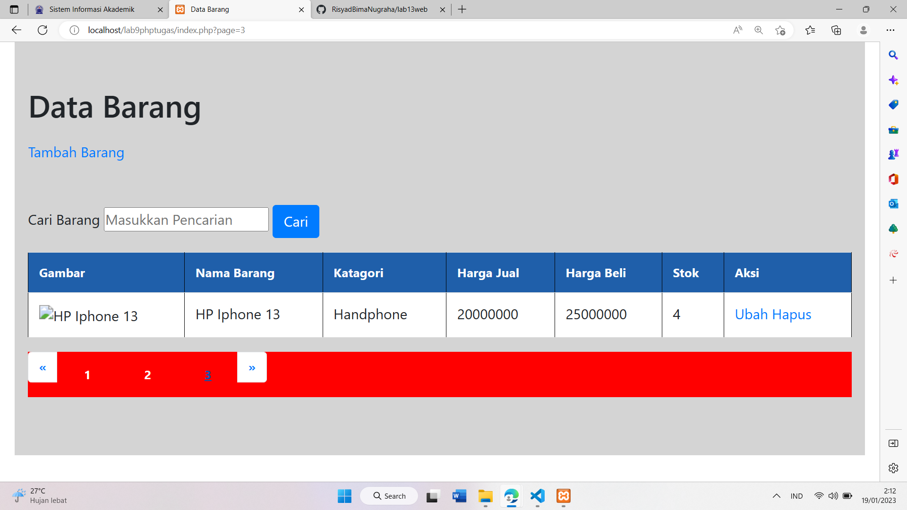

# lab13web
| NAMA  :| RISYAD BIMA NUGRAHA |
| ----- | -----  |
| NIM   :| 312110039 |
| KELAS :| TI.21.B1 |
| Matkul : | Pemograman Web |

| Pagination digunakan untuk membatasi atau membagi record data yang akan ditampilkan pada laman web. Dari seluruh record data yang ada akan dibagi berdasarkan jumlah record perhalaman.Pada prinsipnya untuk membatasi tampilan record data pada query mysql menggunakan LIMIT dan OFFSET; |
| --------- |

 

| Merubah File index.php |
| --- |

  

 

| Hasil Dari Perubahan Index |
| --- |

 